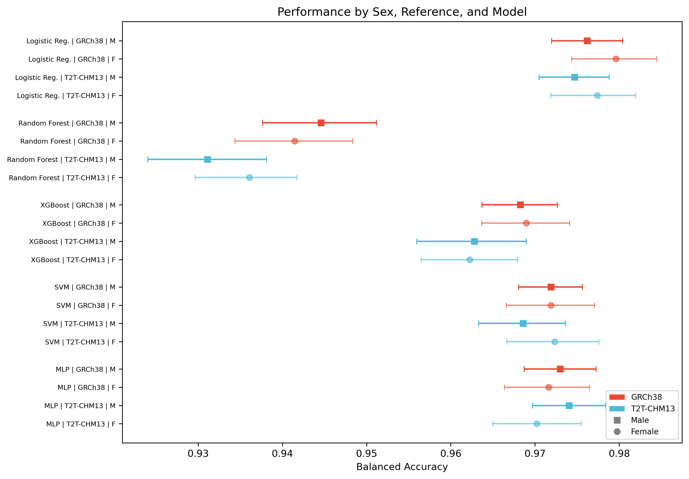
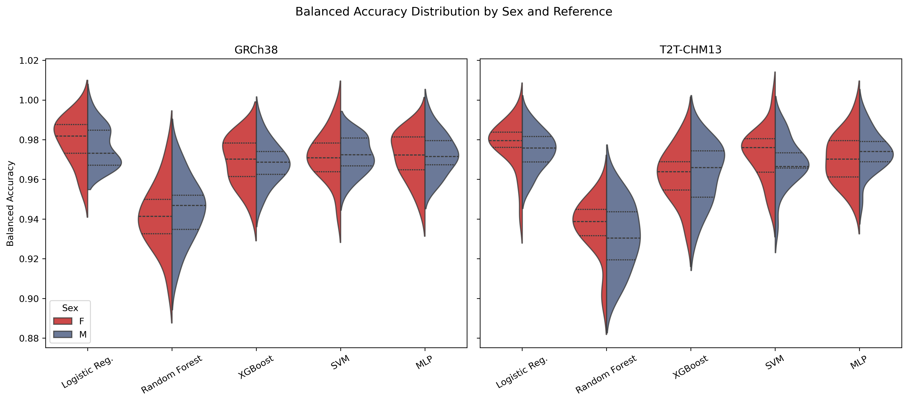
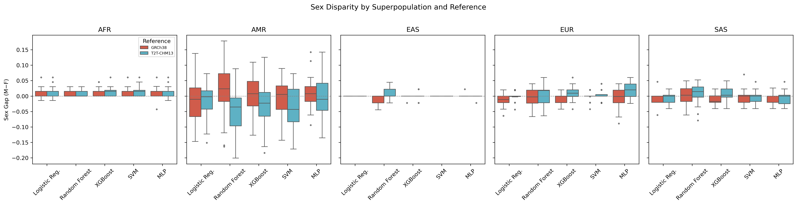
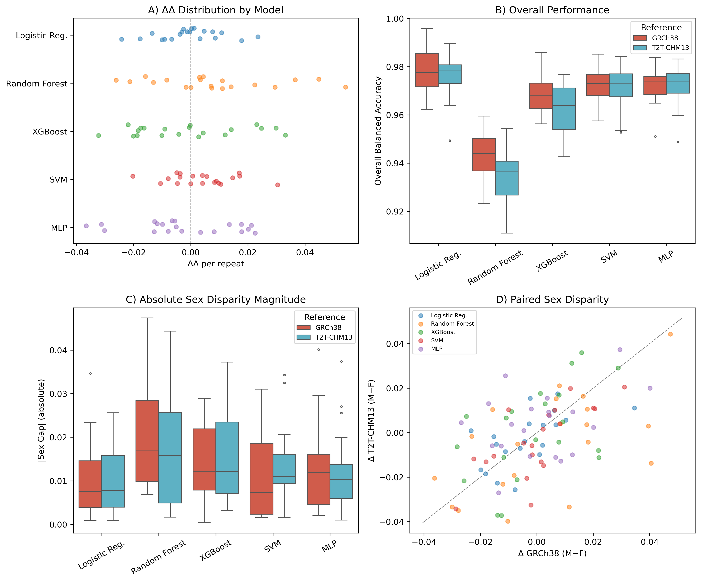

# Built-in Bias? Reference Genome Assembly Reshapes Sex-Linked Variant Representation without Altering Downstream Disparity

**Craig Stillwell, PhD**

**Date:** March 22, 2026

---

## Abstract

**Background:** Reference genome choice shapes variant discovery, and the X chromosome is uniquely sensitive to assembly completeness: sex-specific ploidy means that assembly improvements reveal heterozygous sites primarily in female samples. However, representational differences in variant discovery need not entail bias in downstream analytical endpoints; whether upstream measurement shifts propagate to machine-learning disparity has not been tested.

**Methods:** We analyzed 3,202 individuals (1,603 female, 1,599 male) from the 1000 Genomes Project, comparing sex-stratified chrX variant statistics under GRCh38 and T2T-CHM13v2.0. Downstream sex disparity was quantified using a pre-registered delta-delta estimand ($\Delta\Delta$) across five classifier families (logistic regression, random forest, XGBoost, SVM, MLP), each evaluated over 20 stratified repeats with Holm–Bonferroni correction. A robustness battery comprising label permutation, leave-one-superpopulation-out analysis, and sex-balance stress testing was performed.

**Results:** Female chrX heterozygosity was 6.5% higher under T2T-CHM13 than GRCh38 (paired $\delta$ = +0.039; 95% CI [+0.038, +0.041]; Wilcoxon $p$ = 5.23 × 10⁻²⁰⁰), present in four of five superpopulations. Male chrX heterozygosity remained near zero under both assemblies. Despite this large upstream shift, no classifier showed a significant reference-associated change in sex disparity: all Holm-adjusted $p$ > 0.05, all 95% CIs spanned zero, and the median $\Delta\Delta$ across models was −0.0007. The pre-specified confirmatory framework classified the evidence as Tier C (exploratory).

**Conclusions:** Reference assembly choice produces a substantial, sex-stratified effect on chrX variant representation that does not propagate to detectable shifts in downstream classification sex disparity. Representational and downstream bias evaluations answer distinct questions and require independent empirical assessment.

---

## 1. Introduction

Every variant call is defined relative to a reference assembly. Differences in assembly completeness alter which variants are discoverable, how they are characterized, and what downstream conclusions follow [1]. GRCh38 has served as the community standard for over a decade but retains gaps in centromeric, subtelomeric, and repeat-rich regions that create localized biases in variant calling [2]. T2T-CHM13 is the first gap-free human reference assembly [3], and the recent human pangenome reference [12] further underscores that single-reference frameworks impose systematic blind spots. As T2T transitions into production use for large-cohort analyses, quantifying where and how much analyses shift is a practical priority.

The X chromosome is the most sensitive locus for sex-linked reference effects. ChrX is hemizygous in males and diploid in females, so assembly improvements that resolve previously inaccessible sequence expose heterozygous positions primarily in female samples. Two pseudoautosomal regions (PAR1 and PAR2)—shared with chrY and behaving as diploid in both sexes—have boundary coordinates that differ between assemblies, creating additional potential for sex-differential variant calling at the transitions. The recent completion of the Y chromosome sequence [13] confirms that sex-chromosome assembly quality has lagged autosomes, amplifying these concerns. These properties make chrX a natural stress test for reference-induced measurement asymmetry.

A separate question is whether upstream representational differences propagate to downstream analytical endpoints. Machine-learning classifiers trained on reference-derived variant features could exhibit different sex-disparity profiles if the sex-differential feature distribution shifts between references. This propagation pathway has direct implications for algorithmic fairness assessments in genomic medicine, yet whether reference-induced measurement asymmetries translate into downstream disparity shifts remains empirically untested.

We address both questions using 3,202 individuals from the 1000 Genomes Project [4], comparing sex-stratified chrX variant statistics between GRCh38 and T2T-CHM13 callsets and testing whether any upstream shift alters sex disparity in five downstream classifiers. A pre-specified confirmatory decision framework and robustness battery ensure that conclusions are appropriately calibrated to the strength of the evidence.

---

## 2. Methods

### 2.1 Cohort and data sources

We used publicly available variant callsets from the 1000 Genomes Project [4] aligned to both GRCh38 (NYGC high-coverage, 30×) and T2T-CHM13v2.0. The cohort comprised 3,202 individuals with complete metadata and genotype records in both callsets: 1,603 females and 1,599 males across five continental superpopulations (Table 1).

**Table 1. Cohort composition by superpopulation and sex.**

| Superpopulation | Female (*n*) | Male (*n*) | Total (*n*) |
|:---|---:|---:|---:|
| AFR (African) | 435 | 458 | 893 |
| AMR (Admixed American) | 265 | 225 | 490 |
| EAS (East Asian) | 293 | 292 | 585 |
| EUR (European) | 328 | 305 | 633 |
| SAS (South Asian) | 282 | 319 | 601 |
| **Total** | **1,603** | **1,599** | **3,202** |

For each reference, per-chromosome VCF files (chromosomes 1–22 plus X; 46 VCF files total per reference) were processed to extract per-sample variant features.

### 2.2 Primary analysis: chrX variant metrics

Per-sample variant statistics were extracted from both callsets using `bcftools stats` [5] with per-sample PSC output records. Four metrics were computed per sample per reference: call rate (called genotypes / total sites), heterozygosity rate (heterozygous calls / called sites), variant rate (non-reference genotypes / called sites), and homozygosity rate (homozygous-alternate / variant calls).

The primary region was the full X chromosome. A chromosome 22 autosomal control was analyzed in parallel to assess baseline variation and to construct a sex-normalized heterozygosity ratio (chrX het / chr22 het). Pseudoautosomal regions were analyzed as a secondary layer using reference-specific coordinates: GRCh38 PAR1 (chrX:60001–2699520), GRCh38 PAR2 (chrX:154931044–155260560), T2T PAR1 (chrX:10001–2781479), and T2T PAR2 (chrX:155701383–156030895).

### 2.3 Statistical analysis of variant metrics

Within-reference female-versus-male comparisons used two-sided Mann–Whitney $U$ tests [6]. Paired across-reference comparisons—T2T versus GRCh38 within the same individual—used two-sided Wilcoxon signed-rank tests [7]. Mean differences are reported with bootstrap 95% confidence intervals from 2,000 resamples [8]. Bonferroni correction was applied for the primary Mann–Whitney comparison family.

### 2.4 Downstream model-level disparity analysis

#### 2.4.1 Estimand

The downstream question was formalized as a delta-delta estimand:

$$\Delta\Delta = \Delta_{\text{GRCh38}} - \Delta_{\text{T2T}}$$

where $\Delta_{\text{ref}} = \text{BA}_{\text{male, ref}} - \text{BA}_{\text{female, ref}}$ is the sex gap in balanced accuracy for a given classifier on a given reference. A positive $\Delta\Delta$ indicates that T2T-CHM13 reduces sex disparity relative to GRCh38.

#### 2.4.2 Classifiers and experimental design

Five classifier families were evaluated: logistic regression, random forest, XGBoost [9], support vector machine (SVM), and multilayer perceptron (MLP) [10]. Each classifier was trained to predict superpopulation membership from genome-wide variant features (approximately 11,500 features: 500 variants per chromosome × 23 chromosomes). Superpopulation classification was chosen as the downstream task because it provides a high-signal genomic prediction problem driven largely by autosomal common variation, enabling sensitive detection of reference-induced feature shifts without phenotype confounding.

For each chromosome, the first 500 biallelic SNPs passing minimum quality filters (minor allele frequency ≥ 0.01, call rate ≥ 0.95) were selected in VCF file order. The same filtering thresholds were applied independently to each reference. Genotypes were encoded as diploid dosages (sum of allele values). Male hemizygous chrX calls, represented as single-allele genotypes in the VCF, returned missing values during dosage parsing and were imputed during preprocessing alongside other missing data, consistent with standard practice for mixed-ploidy chromosomes in population-scale analyses.

Each model was run with 20 independent stratified train/test splits (stratified by superpopulation × sex). Preprocessing (imputation and standard scaling) was fit exclusively on training partitions to prevent data leakage. Identical model architecture, hyperparameter settings, and feature-selection logic were applied across references to ensure a fair comparison.

#### 2.4.3 Inference

Bootstrap 95% confidence intervals (5,000 resamples) and paired sign-permutation $p$-values (5,000 permutations) were computed for each model's $\Delta\Delta$ estimate. Holm–Bonferroni step-down correction [11] was applied across the five model families to control the familywise error rate.

#### 2.4.4 Confirmatory decision framework

A four-criterion confirmatory framework was pre-specified:

1. **Directional consistency:** median $\Delta\Delta > 0$ across models.
2. **Uncertainty exclusion:** at least one model's 95% CI excludes zero.
3. **Multiplicity-corrected significance:** at least one Holm-adjusted $p < 0.05$.
4. **Practical effect-size threshold:** $|\Delta\Delta| \geq 0.01$ for at least one model. This threshold corresponds to a one-percentage-point shift in balanced accuracy, below which group-level disparity differences are unlikely to have practical consequences for downstream applications.

Evidence was classified as **Tier A (confirmatory)** if all four criteria were met, **Tier B (suggestive)** if criteria 1–2 passed, or **Tier C (exploratory)** otherwise.

### 2.5 Robustness and sensitivity battery

Three robustness checks were performed per reference:

1. **Label permutation sanity check.** Superpopulation labels were randomly permuted five times and models retrained; performance was required to collapse to approximately 0.20 (chance level for five classes).
2. **Leave-one-superpopulation-out (LOPO) analysis.** Each superpopulation was removed from training in turn while evaluating on the full test set, with sex-stratified balanced accuracy reported.
3. **Sex-balance stress test.** Training data were downsampled to exact sex parity within each superpopulation ($n$ = 2,150) and models retrained to assess whether minor sex-ratio imbalance in the original cohort influenced estimates.

### 2.6 Software and reproducibility

All analyses were performed in Python 3.12 using scikit-learn 1.8.0, XGBoost via scikit-learn API, NumPy 2.4.3, pandas 2.3.3, SciPy 1.17.1, matplotlib 3.10.0, and seaborn 0.13.2. A complete environment snapshot (`pip freeze`, Python version, OS) is archived in `Study_v2_Real_Data/Results/environment/`. Random seeds and split identifiers were saved for every run.

---

## 3. Results

### 3.1 Female chrX heterozygosity is substantially higher under T2T-CHM13

Per-sample chrX statistics were generated for all 3,202 individuals under both references (6,404 sample-reference records). Female chrX heterozygosity under GRCh38 was 0.6052 (SD = 0.0616; $n$ = 1,603) and under T2T-CHM13 was 0.6443 (SD = 0.0550; $n$ = 1,603). The within-individual paired difference was +0.0391 (95% CI [+0.0375, +0.0405]; Wilcoxon $p$ = 5.23 × 10⁻²⁰⁰), a 6.5% relative increase (Figure 1). Standard deviation was lower under T2T (0.0550 vs. 0.0616), indicating that the more complete assembly reduces sample-to-sample noise in callable chrX positions.

The effect was present in all five superpopulations (Figure 4; Table 2), with population-specific magnitudes ranging from −0.006 (AFR) to +0.072 (EUR). The direction was uniform in four of the five populations; the modest negative delta in AFR reflects the already high baseline het rate in this group.

**Table 2. chrX heterozygosity rate by superpopulation, sex, and reference assembly.**

| Superpopulation | Sex | *n* | GRCh38 mean (SD) | T2T mean (SD) | Delta |
|:---|:---|---:|:---|:---|---:|
| AFR | Female | 435 | 0.6627 (0.0599) | 0.6571 (0.0609) | −0.006 |
| AMR | Female | 265 | 0.6026 (0.0591) | 0.6538 (0.0592) | +0.051 |
| EAS | Female | 293 | 0.5442 (0.0193) | 0.5880 (0.0218) | +0.044 |
| EUR | Female | 328 | 0.5949 (0.0368) | 0.6665 (0.0393) | +0.072 |
| SAS | Female | 282 | 0.5944 (0.0403) | 0.6481 (0.0413) | +0.054 |
| AFR | Male | 458 | 0.0021 (0.0001) | 0.0013 (0.0001) | −0.001 |
| AMR | Male | 225 | 0.0039 (0.0348) | 0.0011 (0.0001) | −0.003 |
| EAS | Male | 292 | 0.0015 (0.0001) | 0.0009 (0.0001) | −0.001 |
| EUR | Male | 305 | 0.0016 (0.0001) | 0.0010 (0.0001) | −0.001 |
| SAS | Male | 319 | 0.0016 (0.0001) | 0.0010 (0.0001) | −0.001 |

### 3.2 Male chrX heterozygosity remains near zero under both references

Male chrX het rate was 0.0020 (SD = 0.0130) under GRCh38 and 0.0011 (SD = 0.0002) under T2T-CHM13. The paired difference was −0.0009 (Wilcoxon $p$ = 7.36 × 10⁻²⁶³). While statistically significant, this is biologically trivial—effectively zero under both assemblies, as expected for hemizygous chrX in males.

### 3.3 Female call rate diverges across assemblies

Female chrX call rate was 1.0000 under GRCh38 and 0.9172 under T2T-CHM13 ($\delta$ = −0.0828; $p$ = 1.64 × 10⁻²⁶³). This reduction reflects expanded coordinate space under T2T rather than inferior coverage: T2T contains sites absent from GRCh38, which register as uncalled in a per-site denominator. Male call rate showed a smaller reduction (1.0000 to 0.9965; $\delta$ = −0.0035).

### 3.4 PAR regions show reference-specific sex-disparity patterns

PAR1 heterozygosity showed no sex difference under GRCh38 (female − male = −0.0019; Mann–Whitney $p$ = 0.856) but a large sex difference under T2T-CHM13 (+0.4203; $p$ < 2.2 × 10⁻¹⁶). PAR2 showed the reverse: a large sex difference under GRCh38 (+0.4884; $p$ < 2.2 × 10⁻¹⁶) that could not be assessed under T2T because the 1KGP T2T callset contains no variant records in the T2T-specific PAR2 coordinate range (chrX:155,701,383–156,030,895), likely because the variant-calling pipeline treated this region differently under the T2T assembly. These opposing patterns are consistent with different PAR boundary placements between assemblies producing different diploid/haploid calling behavior across sexes in pseudoautosomal transition zones.

### 3.5 Sex-normalized heterozygosity confirms chrX-specificity

The chrX/chr22 normalized het rate showed a large female-male gap under both references (GRCh38: 0.923 vs. 0.003; T2T: 0.941 vs. 0.002; both $p$ < 2.2 × 10⁻¹⁶), and the female ratio was slightly higher under T2T, consistent with assembly-specific recovery of female heterozygous positions on chrX without a proportional shift on the autosomal control.

### 3.6 No reference-driven shift in downstream model-level sex disparity

All five models achieved high balanced accuracy across both references, ranging from 0.934 (random forest, T2T) to 0.978 (logistic regression, GRCh38). Sex-stratified performance was similar within each model–reference combination (Figure 2; Table 3). No classifier showed a significant reference-associated shift in sex disparity after Holm–Bonferroni correction (Figure 1; Table 3).

**Table 3. Delta-delta ($\Delta\Delta$) estimates for sex-disparity shift across reference assemblies.**

| Model | BA (GRCh38) | BA (T2T) | Sex gap (GRCh38) | Sex gap (T2T) | $\Delta\Delta$ | 95% CI | $p$ | Holm $p$ |
|:---|:---:|:---:|:---:|:---:|---:|:---:|---:|---:|
| Logistic Reg. | 0.978 | 0.976 | −0.0034 | −0.0027 | −0.0007 | [−0.006, +0.004] | 0.782 | 1.000 |
| Random Forest | 0.943 | 0.934 | +0.0031 | −0.0050 | +0.0081 | [−0.001, +0.017] | 0.104 | 0.520 |
| XGBoost | 0.969 | 0.963 | −0.0007 | +0.0006 | −0.0013 | [−0.009, +0.007] | 0.767 | 1.000 |
| SVM | 0.972 | 0.971 | +0.0000 | −0.0038 | +0.0038 | [−0.001, +0.009] | 0.163 | 0.653 |
| MLP | 0.972 | 0.972 | +0.0014 | +0.0038 | −0.0024 | [−0.010, +0.005] | 0.547 | 1.000 |

All point estimates scatter around zero. The median $\Delta\Delta$ across models was −0.0007, opposite to the hypothesized direction. None of the four confirmatory criteria were met:

1. **Directional consistency:** failed (median $\Delta\Delta$ < 0).
2. **Uncertainty exclusion:** failed (all CIs span zero).
3. **Multiplicity-corrected significance:** failed (all Holm-adjusted $p$ > 0.05).
4. **Effect-size threshold:** failed (no $|\Delta\Delta| \geq 0.01$).

**Evidence tier: C (exploratory).**

### 3.7 Robustness battery

All three robustness checks were satisfactory.

**Label permutation.** Permuting superpopulation labels collapsed balanced accuracy to chance level in all conditions (Table 4), confirming that models learn genuine population structure rather than artifacts.

**Table 4. Label permutation sanity check results.**

| Reference | Model | True BA | Permuted BA (mean) | Collapsed to chance |
|:---|:---|:---:|:---:|:---:|
| GRCh38 | Logistic Reg. | 0.980 | 0.204 | Yes |
| GRCh38 | Random Forest | 0.936 | 0.209 | Yes |
| T2T | Logistic Reg. | 0.982 | 0.190 | Yes |
| T2T | Random Forest | 0.941 | 0.209 | Yes |

**Leave-one-superpopulation-out.** Removing a superpopulation from training degraded overall BA to the 0.73–0.80 range (Table 5), as expected. No systematic sex-differential pattern emerged: sex-specific BA values tracked closely within each held-out condition.

**Table 5. Leave-one-superpopulation-out balanced accuracy (selected conditions).**

| Reference | Model | Held-out pop. | Male BA | Female BA | Overall BA |
|:---|:---|:---|:---:|:---:|:---:|
| GRCh38 | Logistic Reg. | AFR | 0.784 | 0.763 | 0.773 |
| GRCh38 | Logistic Reg. | AMR | 0.796 | 0.795 | 0.796 |
| GRCh38 | Logistic Reg. | EAS | 0.784 | 0.776 | 0.779 |
| GRCh38 | Logistic Reg. | EUR | 0.797 | 0.800 | 0.799 |
| GRCh38 | Logistic Reg. | SAS | 0.780 | 0.776 | 0.777 |
| T2T | Logistic Reg. | AFR | 0.786 | 0.771 | 0.777 |
| T2T | Logistic Reg. | AMR | 0.792 | 0.800 | 0.796 |
| T2T | Logistic Reg. | EAS | 0.786 | 0.785 | 0.785 |
| T2T | Logistic Reg. | EUR | 0.800 | 0.800 | 0.800 |
| T2T | Logistic Reg. | SAS | 0.789 | 0.780 | 0.784 |
| GRCh38 | Random Forest | AFR | 0.731 | 0.725 | 0.728 |
| GRCh38 | Random Forest | EUR | 0.784 | 0.772 | 0.778 |
| T2T | Random Forest | AFR | 0.729 | 0.752 | 0.741 |
| T2T | Random Forest | EUR | 0.779 | 0.790 | 0.785 |

**Sex-balance stress test.** Downsampling training data to exact sex parity ($n$ = 2,150) preserved accuracy within 0.3 percentage points of the full-data benchmark for all conditions tested (Table 6), confirming that the minor sex imbalance in the original cohort (1,603 F vs. 1,599 M) does not drive the null $\Delta\Delta$ result.

**Table 6. Sex-balance stress test results (downsampled to exact parity, $n$ = 2,150).**

| Reference | Model | Male BA | Female BA | Overall BA |
|:---|:---|:---:|:---:|:---:|
| GRCh38 | Logistic Reg. | 0.980 | 0.971 | 0.975 |
| GRCh38 | Random Forest | 0.949 | 0.933 | 0.941 |
| T2T | Logistic Reg. | 0.986 | 0.985 | 0.985 |
| T2T | Random Forest | 0.923 | 0.943 | 0.934 |

---

## 4. Discussion

### 4.1 A dissociation between representational and downstream effects

The central finding is a dissociation: a large, sex-linked effect on chrX variant representation paired with a null effect on downstream classification sex disparity. This result has methodological significance for how reference-genome bias is conceptualized and audited.

### 4.2 Mechanism of the chrX heterozygosity effect

T2T-CHM13 resolves previously gapped chrX sequence, exposing heterozygous sites that are inaccessible under GRCh38. Because males are hemizygous for non-PAR chrX, these newly recovered sites produce heterozygous calls only in females—predicting the sex-specificity of the observed +0.039 shift without requiring any difference in underlying genetic diversity.

Three observations reinforce this assembly-driven interpretation. First, the reduced standard deviation under T2T (0.055 vs. 0.062) indicates that GRCh38's assembly gaps introduce sample-to-sample noise in which sites happen to be callable, and that a more complete assembly removes this noise. Second, the directional shift is present in four of five superpopulations (Table 2); the modest negative delta in AFR reflects an already-high baseline rather than a reversed mechanism, and the overall pattern rules out a simple population-genetics explanation. Third, the approximately 8.3% female call rate reduction under T2T reflects expanded coordinate space rather than inferior coverage: T2T contains sites absent from GRCh38 that register as uncalled in a per-site denominator. The absence of any analogous sex-differential shift on chromosome 22 confirms chrX-specificity.

The PAR results add a further dimension. Under GRCh38, PAR1 shows no sex difference in heterozygosity ($p$ = 0.856), but under T2T the female-male gap is +0.42; PAR2 shows the reverse pattern. These opposing shifts are consistent with different PAR boundary placements between assemblies producing different diploid/haploid calling behavior across sexes in pseudoautosomal transition zones.

### 4.3 The null downstream result

The null downstream result directly addresses a practical concern: that switching references would alter fairness properties of variant-based ML models. Across five classifier families and after Holm–Bonferroni correction for multiple testing, no significant sex-disparity shift was detected. The pre-specified confirmatory framework classified the evidence as Tier C (exploratory): the median $\Delta\Delta$ was slightly negative (−0.0007), all CIs spanned zero, and no effect reached practical significance.

Two explanations are compatible with this null. First, superpopulation classification is driven primarily by autosomal common-variant signals; the chrX het rate shift, while large in relative terms, may be peripheral to the discriminative features. Second, the female call rate reduction under T2T may partially counterbalance the heterozygosity increase, preserving net feature-vector separability across sexes.

The robustness analyses strengthen this null interpretation. Label permutation confirmed that models learn genuine population structure (permuted accuracy ≈ 0.20). Leave-one-superpopulation-out analysis showed expected performance degradation without sex-differential effects. The sex-balance stress test confirmed that minor cohort imbalance does not drive the result.

### 4.4 Limitations

Four constraints qualify interpretation:

1. **Pipeline confounding.** The two callsets were generated from separate alignment and calling pipelines; mapper version, genotyper parameters, and site-level filtering are confounded with assembly differences. The results rigorously describe what differs between callsets but cannot isolate assembly sequence as the sole driver. Harmonized re-calling from raw reads using identical pipeline parameters (differing only in reference FASTA) would be needed for strict causal isolation.

2. **Non-identical callable regions.** Call rate and het rate differences may partly reflect coverage and filtering disparities rather than pure assembly completeness effects.

3. **Single downstream task.** The $\Delta\Delta$ analysis used a single predictive task (superpopulation classification). Analyses that depend directly on chrX variant density—such as phasing accuracy, X-inactivation inference, or sex-specific GWAS calibration—may behave differently.

4. **Robustness scope.** Not all protocol-specified sensitivity analyses (e.g., MAF-threshold variation, feature-count grids, controlled missingness injection) were executed. The three completed checks (label permutation, LOPO, sex-balance stress) address the most critical threats but do not exhaust all potential confounds.

### 4.5 Practical implications

**For chrX-based analyses:** Reference choice should be treated as an explicit design variable. A +0.039 het rate shift is large enough to affect any analysis that uses female chrX heterozygosity as a metric; it should not be assumed stable across reference versions.

**For bias auditing:** Representational audits and downstream disparity audits answer distinct questions. This study demonstrates that the two can diverge completely—a large upstream representational shift need not propagate to a downstream fairness metric. Both audits require explicit empirical evaluation. Future fairness frameworks for genomic pipelines should incorporate reference-awareness as a design variable alongside conventional protected attributes.

**For reference transition planning:** The null downstream result is encouraging for the GRCh38-to-T2T transition in classification-based analyses, but should not be generalized without task-specific evaluation. Tasks that depend directly on chrX variant density—such as GWAS calibration for X-linked loci, polygenic risk score construction incorporating sex chromosomes, or X-inactivation inference—may exhibit sensitivities that ancestry classification does not capture.

---

## 5. Conclusions

Female chrX heterozygosity is 6.5% higher under T2T-CHM13 than GRCh38 ($\delta$ = +0.0391; 95% CI [+0.0375, +0.0405]; $p$ = 5.23 × 10⁻²⁰⁰), an effect observed across all five superpopulations (four of five showing the expected positive direction) and attributable to improved chrX assembly completeness. Male chrX heterozygosity remains near zero under both assemblies. Despite this large upstream effect, five downstream classifier families show no reference-associated shift in sex disparity (all Holm-adjusted $p$ > 0.05; all CIs span zero; evidence Tier C). This decoupling establishes that upstream and downstream bias evaluations address distinct questions, and both require explicit empirical examination.

---

## Data Availability

All analysis code, results, and publication figures are available at https://github.com/rstil2/reference-genome-sex-bias. Primary variant-level results are in `Results/variant_analysis/`. Delta-delta summaries with Holm–Bonferroni correction for all five classifiers are in `Results/metrics/final/all_models_holm_corrected.json`. Robustness battery outputs are in `Results/robustness/`. Publication-quality figures are in `Figures/`. A complete environment snapshot is archived in `Results/environment/`. Raw VCF data are publicly available from the 1000 Genomes Project (GRCh38: NYGC high-coverage callset; T2T-CHM13v2.0: 1000 Genomes on T2T callset).

---

## References

1. Schneider VA, Graves-Lindsay T, Howe K, et al. Evaluation of GRCh38 and de novo haploid genome assemblies demonstrates the enduring quality of the reference assembly. *Genome Res.* 2017;27(5):849–864.
2. Aganezov S, Yan SM, Payne A, et al. A complete reference genome improves analysis of human genetic variation. *Science.* 2022;376(6588):eabl3533.
3. Nurk S, Koren S, Rhie A, et al. The complete sequence of a human genome. *Science.* 2022;376(6588):44–53.
4. The 1000 Genomes Project Consortium. A global reference for human genetic variation. *Nature.* 2015;526(7571):68–74.
5. Danecek P, Bonfield JK, Liddle J, et al. Twelve years of SAMtools and BCFtools. *GigaScience.* 2021;10(2):giab008.
6. Mann HB, Whitney DR. On a test of whether one of two random variables is stochastically larger than the other. *Ann Math Stat.* 1947;18(1):50–60.
7. Wilcoxon F. Individual comparisons by ranking methods. *Biometrics Bull.* 1945;1(6):80–83.
8. Efron B, Tibshirani RJ. Bootstrap methods for standard errors, confidence intervals, and other measures of statistical accuracy. *Stat Sci.* 1986;1(1):54–75.
9. Chen T, Guestrin C. XGBoost: A scalable tree boosting system. In: *Proc. 22nd ACM SIGKDD Int. Conf. Knowledge Discovery and Data Mining.* 2016:785–794.
10. Pedregosa F, Varoquaux G, Gramfort A, et al. Scikit-learn: Machine learning in Python. *J Mach Learn Res.* 2011;12:2825–2830.
11. Holm S. A simple sequentially rejective multiple test procedure. *Scand J Stat.* 1979;6(2):65–70.
12. Liao WW, Asri M, Ebler J, et al. A draft human pangenome reference. *Nature.* 2023;617:312–324.
13. Rhie A, Nurk S, Cechova M, et al. The complete sequence of a human Y chromosome. *Nature.* 2023;621:344–354.

---

## Figures

